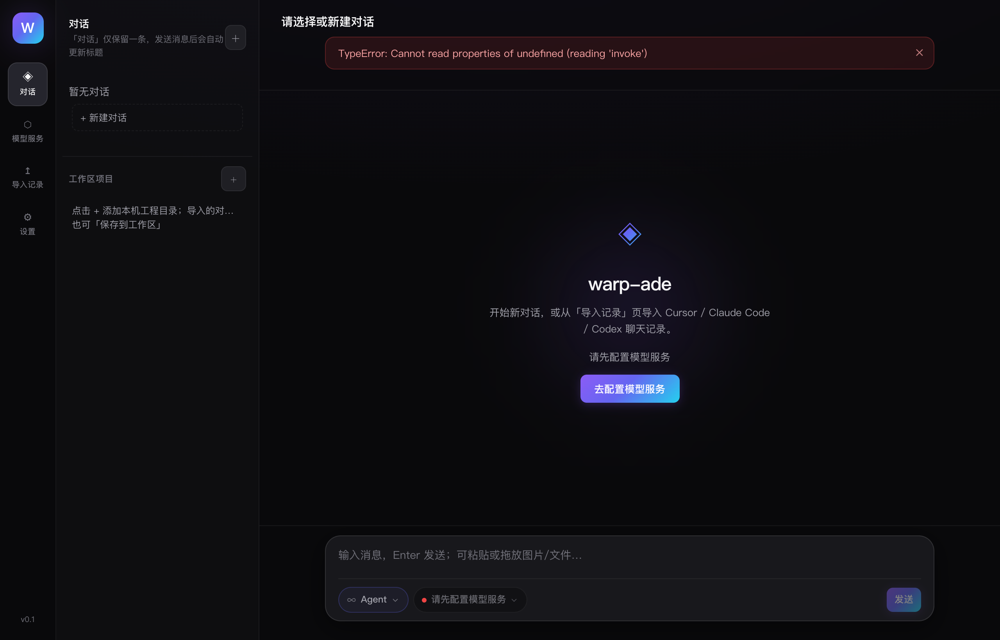
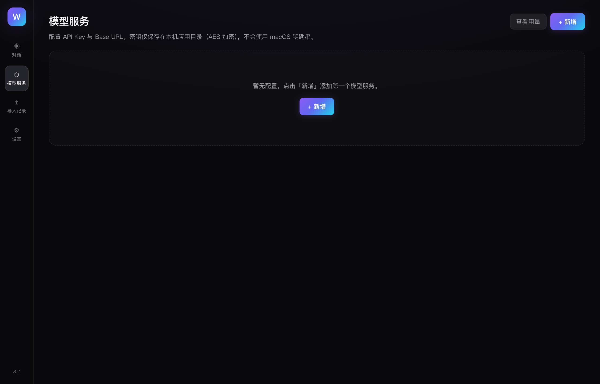
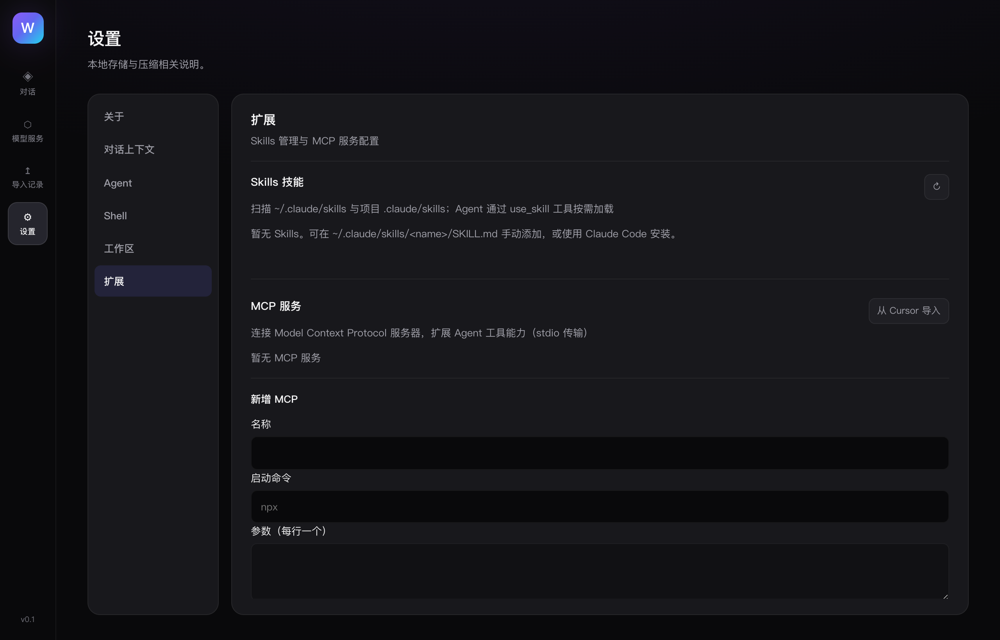
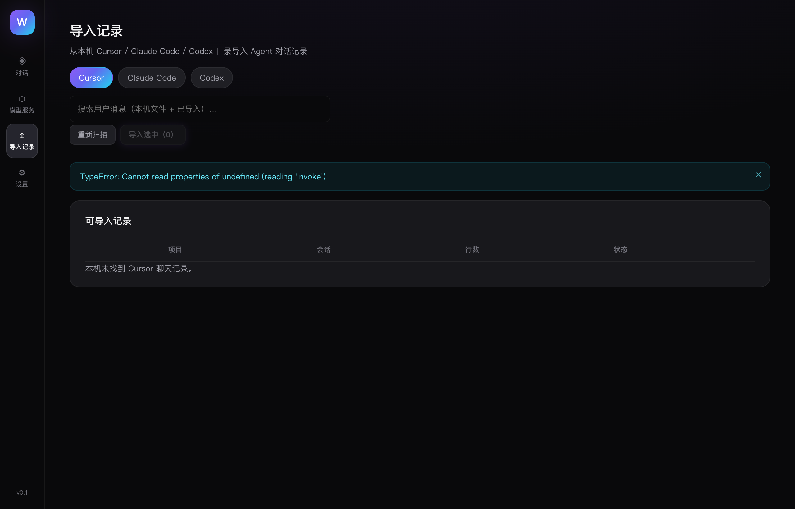

# warp-ade

轻量本地 App：**自定义模型配置 + 项目 Agent 开发 + MCP/Skills**。  
四核是产品重心；**已有功能全部保留**，后续新增从简、不堆非核心能力。

Mac-first · Tauri 2 + Rust + React

## 下载（macOS）

| 平台 | 要求 | 下载 |
|------|------|------|
| Apple Silicon (M 系列) | macOS 13+ | [warp-ade_0.1.0_aarch64.dmg](https://github.com/zyun6903-max/warp-ade/releases/latest/download/warp-ade_0.1.0_aarch64.dmg) |

1. 打开 DMG，将 **warp-ade** 拖入「应用程序」文件夹  
2. 首次使用请先在 **模型服务** 中配置 Provider 与 API Key

> 最新版本与更新说明见 [Releases](https://github.com/zyun6903-max/warp-ade/releases)

### 打不开 / 提示「已损坏，无法打开」？

当前版本**未做 Apple 开发者签名与公证**，macOS 会误报为「已损坏」。**所有从网络下载的未签名应用都会这样**，不是安装包坏了。

#### 方式 A：离线安装（公司内网 / 443 连不上 GitHub 时首选）

**443 不是 HTTP 错误码**，而是 HTTPS 端口；报错里出现 `port 443` / `Failed to connect` 表示**根本连不上外网**（公司防火墙常见），在线脚本无法使用。

由你在能上网的 Mac 下载好两个文件，打包发给同事（U 盘、内网 NAS、邮件附件均可）：

| 文件 | 说明 |
|------|------|
| `warp-ade_0.1.0_aarch64.dmg` | [Releases 下载](https://github.com/zyun6903-max/warp-ade/releases/latest) |
| `scripts/install-from-local.sh` | 仓库内离线安装脚本 |

同事解压后，在终端执行（**不需要网络**）：

```bash
cd ~/Downloads/warp-ade-install   # 两个文件所在目录
bash install-from-local.sh
```

#### 方式 B：在线一键安装（需能访问外网）

```bash
curl -fsSL https://cdn.jsdelivr.net/gh/zyun6903-max/warp-ade@main/scripts/install-macos.sh | bash
```

若公司需走代理：`export HTTPS_PROXY=http://代理地址:端口` 后再执行。

在线失败、但已有 DMG 时：

```bash
WARP_ADE_DMG=~/Downloads/warp-ade_0.1.0_aarch64.dmg bash install-from-local.sh
```

#### 方式 B：手动安装

```bash
# 1. 从 GitHub 下载 DMG 到「下载」文件夹（不要用钉钉/微信转发）
# 2. 终端执行：
xattr -cr ~/Downloads/warp-ade_0.1.0_aarch64.dmg
open ~/Downloads/warp-ade_0.1.0_aarch64.dmg
# 3. 拖入「应用程序」后：
xattr -cr /Applications/warp-ade.app
open /Applications/warp-ade.app
```

#### 方式 C：不用终端

Finder 中 **Control + 点击 warp-ade → 打开 → 仍要打开**（安装到「应用程序」后对 `.app` 各操作一次）。

若仍被拦截：**系统设置 → 隐私与安全性 → 仍要打开**。

#### 分发时注意

| 做法 | 结果 |
|------|------|
| 同事自己从 GitHub Releases 下载 | ✅ 配合上面任一方式即可 |
| 钉钉 / 微信 / 飞书传 `.dmg` | ❌ 隔离标记更重，几乎必报错 |
| 内网文件服务器 + 安装脚本 | ✅ 可以 |
| Apple 签名 + 公证（$99/年） | ✅ 双击即装，无需绕过 |

> 长期方案：配置 Apple Developer 签名 + 公证后，可像其他成熟项目一样直接双击安装。

## 界面预览

### 对话 · 项目 Agent

在项目工作区中运行 Agent：读/写文件、grep、Shell、工具循环。



### 模型服务

配置 Provider、Base URL、模型列表、优先级与 Failover；支持逐模型测试与用量统计。



### 扩展 · Skills 与 MCP

管理 Skills 启用状态，配置 MCP Server，扩展 Agent 工具能力。



### 导入历史

从 Cursor / Claude Code / Codex 批量导入会话，继续对话。



## 四核能力

| 核 | 来自 | 做什么 |
|----|------|--------|
| **模型配置** | CC Switch | Provider、Base URL、模型、优先级、Failover、Keychain |
| **项目开发** | Codex | 绑定工作区目录，在项目里跑 Agent 改代码 |
| **Agent** | Cursor | 读/写/改文件、grep、shell、工具循环（不是 IDE） |
| **插件/技能** | Claude | MCP Server、Skills、CLAUDE.md 项目上下文 |

## 已有能力（保留）

- 三源历史导入（Cursor / Claude Code / Codex）· 继续对话 · 批量导入进度
- 语义代码搜索 · Web 搜索 · 附件粘贴 · Git 环境面板（分支 / 提交 / 推送）
- 工具/Shell 审计 · Rolling Summary · 会话导出 · MCP 管理 · 原生 Skills 按需加载

> 范围与迭代原则：[`docs/plans/2026-06-11-replacement-parity.md`](docs/plans/2026-06-11-replacement-parity.md)

## 开发

```bash
pnpm install
pnpm tauri dev
```

## 构建

```bash
pnpm tauri build
```

产物位于 `src-tauri/target/release/bundle/`（`.app` 与 `.dmg`）。

### 发布新版本

```bash
git tag v0.1.0
git push origin v0.1.0
```

推送 tag 后 GitHub Actions 会自动构建 macOS 安装包并上传到 Release。

### 更新 README 截图

```bash
pnpm preview --port 4173 &
pnpm screenshots
```
