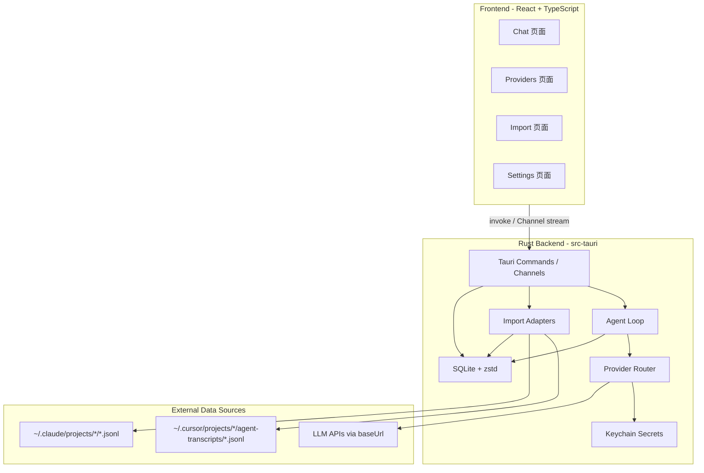

# feat: Cross-Platform AI Development Environment (warp-ade)

## Overview

**warp-ade** 是一款本地安装的跨平台 AI 开发环境（ADE），对标 Codex App / Warp ADE 的产品形态，并融合 CC Switch 的多 Provider 管理能力。用户可在 Mac 上通过可视化界面完成：多 API Key / Base URL 配置与自动切换、AI Agent 对话、Cursor 与 Claude Code 聊天记录导入，以及本地持久化存储与压缩以节省磁盘与 Token。

**当前仓库状态：** 100% greenfield（仅 `README.md` + Rust `.gitignore`），无现有实现代码。

**技术选型（已决策）：**

| 层级 | 选型 | 理由 |
|------|------|------|
| 桌面框架 | **Tauri 2** + Rust + React/TypeScript | 与 README 中 CC Switch 参考一致；Mac 原生体验；跨平台扩展成本低 |
| 本地存储 | **SQLite** (WAL) + **zstd** 压缩 BLOB | 可索引查询 + 高压缩比 |
| 密钥管理 | **macOS Keychain** (`keyring-core`) | API Key 永不进入 WebView / SQLite |
| Agent | **内置 Rust Agent 循环** | 原生 ADE 体验；HTTP 调用全在 Rust 侧 |
| Provider 路由 | **嵌入式 Router**（参考 CC Switch） | 无需外部代理进程；支持优先级 + 熔断 failover |

**平台策略：** Mac-first（Phase 1 交付 `.dmg`），Tauri 2 天然支持 Windows/Linux，Phase 3 扩展。

---

## Problem Statement

开发者在使用 Cursor、Claude Code、Codex 等 AI 工具时面临以下痛点：

1. **对话历史分散** — Cursor 与 Claude 的聊天记录存储在不同路径、不同 JSONL 格式，无法统一检索与延续上下文。
2. **Provider 切换繁琐** — 多个 API Key、自定义 Base URL（代理/网关）需要手动改配置文件，无法自动 failover。
3. **缺乏统一 ADE** — Codex/Warp 提供 Agent 能力但绑定特定生态；缺少可本地安装、可自配 Provider 的独立 ADE。
4. **Token 与存储成本** — 长对话历史占用磁盘且直接送入模型会浪费 Token；需要分层压缩策略。

warp-ade 旨在成为开发者本地的 **AI 开发中枢**：导入历史、统一管理 Provider、内置 Agent、可视化操作一切。

---

## Proposed Solution

### 产品架构



### 核心页面（可视化 UI）

| 页面 | 功能 |
|------|------|
| **Chat** | 会话列表侧边栏、流式 Markdown 渲染、Tool Call 卡片、Thinking 折叠块、来源徽章（Cursor / Claude / Native） |
| **Providers** | Provider CRUD（名称、baseUrl、模型、优先级）、Keychain 状态、健康指示器、连接测试、拖拽排序 |
| **Import** | 扫描 Cursor / Claude 路径、预览会话列表、批量导入、进度条、重复导入幂等 |
| **Settings** | 压缩阈值、Context Token 预算、Summarizer 模型、数据目录、导出/删除 |
| **Agent** | 会话级 Agent 开关、工具执行确认对话框（危险操作） |

### 关键设计决策

| 决策 | 选择 | 理由 |
|------|------|------|
| Agent 实现 | 内置 Rust Agent Loop（v1 只读工具 + 可选 shell 确认） | 用户要求 App 内 Agent 功能；CLI 编排延迟高、体验割裂 |
| 导入后可否继续对话 | **可以** — 创建 `continued` 关联会话，保留 `provenance` 元数据 | 导入历史的核心价值是延续上下文 |
| Failover 顺序 | 同 Profile 备用 Key → 下一优先级 Profile 同模型 → 下一 Profile 降级模型 | 对齐 CC Switch / LiteLLM 模式 |
| 「压缩省 Token」 | **双层**：(1) zstd 磁盘压缩；(2) API 发送时 Rolling Summary + 保留最近 N 轮原文 | zstd 本身不减少 LLM 输入 Token；需独立的 Context 策略 |
| Subagent 处理 | 作为可选分支展示，默认折叠；不合并进主时间线 | 避免 Cursor/Claude 子 Agent 文件污染主对话 |
| CC Switch 关系 | 独立实现，Provider 配置格式 **兼容** `~/.claude/settings.json` 读写（可选） | README 提及 CC Switch；不依赖其运行时 |
| 导入模式 | 手动扫描 + 幂等 re-import（`dedup_hash`）；Phase 3 可选文件监听 | MVP 复杂度可控 |

---

## Technical Approach

### Architecture

#### 项目结构

```
warp-ade/
├── package.json                 # pnpm — React + Vite
├── src/                         # Frontend
│   ├── pages/
│   │   ├── Chat.tsx
│   │   ├── Providers.tsx
│   │   ├── Import.tsx
│   │   └── Settings.tsx
│   ├── components/
│   ├── stores/                  # Zustand
│   └── lib/tauri.ts
│
└── src-tauri/
    ├── Cargo.toml
    ├── tauri.conf.json
    ├── capabilities/
    ├── migrations/
    └── src/
        ├── commands/            # Tauri IPC 薄层
        ├── agent/
        │   ├── loop.rs          # Agent 主循环
        │   ├── context.rs       # Rolling summary + memory
        │   └── tools/           # read_file, grep, shell (需确认)
        ├── providers/
        │   ├── router.rs        # Failover + circuit breaker
        │   ├── transformers/    # OpenAI ↔ Anthropic 格式转换
        │   └── stream.rs        # SSE 流解析
        ├── storage/
        │   ├── db.rs            # rusqlite + migrations
        │   └── compression.rs   # zstd encode/decode
        ├── import/
        │   ├── cursor.rs        # Cursor JSONL adapter
        │   ├── claude.rs        # Claude Code JSONL adapter
        │   └── canonical.rs     # 统一消息模型
        └── secrets/
            └── keychain.rs      # keyring-core
```

#### 统一消息模型（Canonical Schema）

所有来源（Native / Cursor / Claude）导入后映射为同一结构：

```typescript
interface CanonicalMessage {
  id: string;
  sessionId: string;
  seq: number;
  role: 'user' | 'assistant' | 'tool' | 'system';
  parts: MessagePart[];  // text | tool_call | tool_result | thinking | attachment
  timestamp?: string;
  metadata: {
    source: 'native' | 'cursor' | 'claude_code';
    sourceUuid?: string;
    parentUuid?: string;
    isMeta?: boolean;
    subagent?: boolean;
  };
}
```

#### SQLite Schema

```sql
-- 会话元数据（未压缩，可索引）
CREATE TABLE sessions (
  id TEXT PRIMARY KEY,
  title TEXT,
  source TEXT NOT NULL,           -- 'native' | 'cursor' | 'claude_code'
  source_path TEXT,
  source_session_id TEXT,
  project_slug TEXT,
  workspace_path TEXT,            -- 解码后的本地路径
  cwd TEXT,
  git_branch TEXT,
  continued_from TEXT,            -- 关联的导入会话 ID
  created_at INTEGER NOT NULL,
  updated_at INTEGER NOT NULL,
  token_count INTEGER DEFAULT 0
);

CREATE TABLE messages (
  id TEXT PRIMARY KEY,
  session_id TEXT NOT NULL REFERENCES sessions(id),
  seq INTEGER NOT NULL,
  role TEXT NOT NULL,
  message_type TEXT,
  preview TEXT,                   -- 前 500 字符，供 FTS 搜索
  body_compressed BLOB NOT NULL,  -- zstd(canonical JSON)
  dedup_hash TEXT UNIQUE,
  created_at INTEGER NOT NULL
);

-- Rolling Summary（API Context 压缩）
CREATE TABLE context_nodes (
  id TEXT PRIMARY KEY,
  session_id TEXT NOT NULL,
  depth INTEGER DEFAULT 0,
  summary TEXT NOT NULL,
  token_count INTEGER,
  covers_seq_start INTEGER,
  covers_seq_end INTEGER,
  created_at INTEGER NOT NULL
);

CREATE VIRTUAL TABLE messages_fts USING fts5(
  preview, session_id, content='messages', content_rowid='rowid'
);

CREATE TABLE providers (
  id TEXT PRIMARY KEY,
  name TEXT NOT NULL,
  base_url TEXT NOT NULL,
  api_format TEXT NOT NULL,       -- 'anthropic_messages' | 'openai_chat'
  models TEXT NOT NULL,           -- JSON array
  priority INTEGER NOT NULL,
  enabled INTEGER DEFAULT 1,
  keychain_account TEXT NOT NULL  -- Keychain 引用，非明文
);
```

**数据目录：** `~/Library/Application Support/com.warpade.app/warp-ade.db`

#### 导入数据源

| 来源 | 路径 | 格式特征 |
|------|------|----------|
| **Cursor** | `~/.cursor/projects/*/agent-transcripts/<uuid>/<uuid>.jsonl` | 顶层 `role`；`message.content[]` 含 `text` / `tool_use`；子 Agent 在 `subagents/` |
| **Cursor（历史）** | `~/Library/Application Support/Cursor/User/globalStorage/state.vscdb` | SQLite blob；Phase 3 backfill |
| **Claude Code** | `~/.claude/projects/<encoded-path>/<session-id>.jsonl` | 顶层 `type`；`parentUuid` 图；attachments / queue-operation 等 |

**导入流水线：**

```
Discover → Parse (streaming) → Filter (skip isMeta/hooks) → Normalize → Dedup → zstd Store → FTS Index
```

#### Provider Router & Failover

```json
{
  "routing": {
    "default_model": "claude-sonnet-4-6",
    "failover_enabled": true,
    "max_retries": 3,
    "retryable_errors": [429, 500, 502, 503, 504],
    "timeout_secs": 60
  }
}
```

**熔断器状态：** Closed → Open → Half-Open

| 参数 | 默认值 |
|------|--------|
| 连续失败阈值 | 3 |
| 恢复等待 | 60s |
| 401/403 | 不 failover，标记 Key 无效 |
| 429 | 立即 cooldown 该 Provider |

**协议支持（v1）：** Anthropic Messages API + OpenAI Chat Completions（含兼容网关）；格式转换 via transformer chain。

#### 双层压缩策略

**Layer 1 — 磁盘压缩（zstd level 3）：**

- 完整消息 JSON 存入 `body_compressed` BLOB
- 搜索用 `preview` 明文 + FTS5
- 目标：磁盘占用减少 40%+

**Layer 2 — API Context 压缩（省 Token）：**

```
┌─────────────────────────────────────┐
│ System prompt（固定）                │
├─────────────────────────────────────┤
│ Rolling summary（~1-2K tokens）     │
├─────────────────────────────────────┤
│ Structured memory（决策/文件/偏好）  │
├─────────────────────────────────────┤
│ 最近 8-15 轮原文（含 tool 结果）     │
└─────────────────────────────────────┘
```

| 规则 | 值 |
|------|-----|
| 触发阈值 | Context 用量达模型窗口 60-80% |
| Summarizer | 廉价模型（Haiku / Flash） |
| 永不压缩 | Tool 错误、用户明确偏好、最近 N 轮 |
| 原始数据 | 始终保留在 SQLite；Summary 为派生 |

#### Agent Loop（v1 范围）

```
User message
    ↓
Context builder (summary + recent + memory)
    ↓
LLM stream (via ProviderRouter)
    ↓
Parse tool calls ←──┐
    ↓               │
Execute tools       │ loop (max 25 iterations)
    ↓               │
Append results ─────┘
    ↓
Persist to SQLite + emit Tauri Channel events
```

**v1 内置工具：**

| 工具 | 说明 | 权限 |
|------|------|------|
| `read_file` | 读取工作区文件 | 工作区内自动；工作区外需确认 |
| `list_directory` | 列出目录 | 同上 |
| `grep_project` | 项目内搜索 | 同上 |
| `search_history` | 搜索本地聊天记录 | 自动 |
| `run_command` | 执行 Shell | **每次需用户确认**（v1） |

**流式 IPC：** Tauri `Channel<AgentUiEvent>` 推送 token / tool_start / tool_result / done。

#### 安全模型

| 项 | 策略 |
|----|------|
| API Key | 仅存 Keychain；Rust-only 读取；前端只显示 `has_key` / 末 4 位 |
| HTTP 调用 | 全部在 Rust 侧；WebView 不接触 Authorization |
| 导入路径 | 只读访问；用户确认扫描范围；禁止任意路径遍历 |
| Agent Shell | 用户确认 + 本地审计日志 |
| 导入敏感内容 | 可选扫描 `sk-` / `AKIA` / `Bearer` 并标记 |
| 网络 | 仅连接用户配置的 baseUrl；默认无遥测 |
| Tauri Capabilities | 最小权限；`build.rs` command allowlist |

---

### Implementation Phases

#### Phase 1: Foundation（4-6 周）

**目标：** 可运行的 Mac App — 基础聊天 + 单 Provider + Cursor 导入 + 本地存储

| 任务 | 交付物 |
|------|--------|
| Tauri 2 脚手架 | `pnpm create tauri-app`；React + Tailwind + shadcn/ui |
| SQLite + zstd 存储层 | Schema migrations；消息 CRUD；FTS5 |
| Keychain 集成 | `store_api_key` / `delete_api_key` / `has_api_key` commands |
| 单 Provider 聊天 | 流式对话；Channel 推送；消息持久化 |
| Cursor JSONL 导入 | Scanner + Adapter + 幂等导入 |
| 基础 UI | Chat + Providers + Import + Settings 四页面骨架 |
| Mac 打包 | Ad-hoc sign `.dmg`（dev）；文档化 notarization 流程 |

**成功标准：**
- [ ] App 启动 → 配置 Provider → 发送消息 → 流式响应 → 重启后会话仍在
- [ ] 导入 10 个 Cursor 会话 < 10s；UI 正确渲染 tool blocks
- [ ] API Key 不出现在 SQLite / 日志 / 前端存储

#### Phase 2: Agent + Multi-Provider（4-6 周）

**目标：** Agent 能力 + 多 Provider failover + Claude 导入 + Context 压缩

| 任务 | 交付物 |
|------|--------|
| Agent tool loop | read/grep/search_history + shell 确认 |
| Provider Router | 优先级排序 + circuit breaker + failover |
| Provider UI 完善 | 健康徽章、连接测试、拖拽排序 |
| Claude Code 导入 | parentUuid 重建 + thinking 折叠 |
| Rolling Summary | 阈值触发 + Summarizer 模型配置 |
| 导入会话继续对话 | `continued_from` 关联 + provenance 徽章 |
| Developer ID 签名 + Notarization | Gatekeeper 通过 |

**成功标准：**
- [ ] Agent 读取工作区文件并回答；Shell 需确认
- [ ] Provider A 429 → 自动切换 Provider B < 3s
- [ ] Claude 6000 行会话导入 + 正确排序
- [ ] Context 超预算时自动 Summary，API Token 用量下降可观测

#### Phase 3: Polish & Cross-Platform（持续）

| 任务 | 交付物 |
|------|--------|
| Cursor SQLite 历史 backfill | 旧版 state.vscdb 导入 |
| sqlite-zstd 字典压缩 | 磁盘压缩比 2-5x 提升 |
| Hierarchical context DAG | pi-lcm 风格 drill-down |
| 系统托盘快速切换 Provider | Menu bar icon |
| 自动更新 | `tauri-plugin-updater` |
| Windows / Linux 移植 | Keychain 抽象为 SecretStore trait |
| CC Switch 配置兼容 | 可选读写 `~/.claude/settings.json` |

---

## Alternative Approaches Considered

| 方案 | 优点 | 缺点 | 结论 |
|------|------|------|------|
| **Electron + Node** | 生态成熟 | 包体积大、内存高、Key 易泄露到 Renderer | ❌ 拒绝 |
| **纯 Rust TUI** | 轻量 | 用户要求可视化页面 | ❌ 拒绝 |
| **CLI 编排（spawn Codex/Claude Code）** | 快速 MVP | 体验割裂、难以统一 UI/存储 | ❌ 作 v2 可选集成 |
| **外部 LiteLLM 代理** | 路由成熟 | 多进程、部署复杂 | ❌ 拒绝；嵌入式 Router 足够 |
| **直接 fork CC Switch** | Provider 现成 | ADE/Agent/存储非其定位 | ❌ 参考而非 fork |
| **Tauri 2 + Rust Agent** ✅ | 安全、性能、跨平台 | 开发量较大 | ✅ 选用 |

---

## System-Wide Impact

### Interaction Graph

```
用户发送消息
  → Tauri command `run_agent_turn`
    → ContextBuilder.load(session_id)
      → SQLite: decompress recent messages + load context_nodes
    → ProviderRouter.complete(context, model)
      → Keychain.get_key(provider.keychain_account)
      → HTTP POST baseUrl (stream)
      → [failover] on 429/5xx → next provider
    → AgentLoop.parse_tools(response)
      → ToolExecutor.run(tool_call)
        → FS read / shell (with approval)
      → loop until no tool calls
    → Storage.persist_turn(messages)
      → zstd compress → SQLite INSERT
      → [async] SummaryService.maybe_compress(session_id)
    → Channel.send(AgentUiEvent) → React UI update
```

### Error & Failure Propagation

| 层级 | 错误类型 | 处理 |
|------|----------|------|
| HTTP | 429/5xx | Router failover → UI 显示路由切换 |
| HTTP | 401/403 | 标记 Key 无效 → 用户重新配置 |
| HTTP | Timeout | Retry → failover → 用户错误提示 |
| Import | 损坏 JSONL 行 | Skip + warning；summary 报告跳过数 |
| Import | 权限拒绝 | 引导 macOS 隐私设置 |
| Storage | zstd 解压失败 | 单条消息 error chip；其余正常 |
| Agent | Tool 执行失败 | 结果写入 tool_result；Agent 自行处理 |
| Agent | Max iterations | 通知用户；保存已完成的 turns |

### State Lifecycle Risks

| 场景 | 风险 | 缓解 |
|------|------|------|
| 流式响应中崩溃 | 不完整 assistant 消息 | 标记 `partial: true`；重启可 discard 或保留 |
| 导入中断 | 部分会话写入 | 事务 per session；dedup_hash 幂等 |
| Failover 中途切换 Provider | Tool schema 不兼容 | 同 turn 内不切换 Provider；failover 在 turn 边界 |
| Summary 异步写入 | 下一请求用旧 summary | 版本号 + 发送前 check |

### API Surface Parity

| 接口 | Native Chat | Imported View | Agent Mode |
|------|-------------|---------------|------------|
| 发送消息 | ✅ | ✅（continued 会话） | ✅ |
| Tool 执行 | ❌ | ❌ | ✅ |
| Provider 选择 | ✅ | ✅ | ✅ |
| 搜索 | ✅ | ✅ | ✅ |
| 导出 | ✅ | ✅ | ✅ |

### Integration Test Scenarios

1. **Cursor 导入 → 查看 → 继续对话** — 完整 E2E；tool blocks 可见；新消息 append 到 continued 会话
2. **Claude parentUuid 乱序重建** — Fixture 乱序 JSONL → 显示顺序正确
3. **Provider failover 中途聊天** — Mock 429 → 自动切换 → UI 指示
4. **401 不 failover** — 显示错误；不静默使用下一 Provider
5. **Keychain 重启 round-trip** — 重启后发消息成功
6. **流式崩溃恢复** — Kill mid-stream → 重启 → 之前 turns 完整
7. **6000 行大会话** — 导入 < 30s；滚动流畅
8. **并发两会话** — 独立 failover 状态；消息不串
9. **Agent 工作区边界** — 读 `/etc/passwd` 被 block 或需确认
10. **zstd blob 损坏** — 单条 error；其余正常
11. **FS 权限拒绝导入** — 可操作错误 + 设置引导
12. **离线发送** — 立即错误；消息不丢失（可选 queue）

---

## Acceptance Criteria

### Functional Requirements

#### 应用壳
- [ ] macOS 13+ 可安装运行；Release 构建通过 Gatekeeper（notarized）
- [ ] 首次启动无 Provider 时引导配置；Chat 发送按钮 disabled + CTA
- [ ] 数据目录 `~/Library/Application Support/com.warpade.app/`

#### 聊天 & Agent
- [ ] 新建/打开/删除会话；流式 Markdown + 代码高亮
- [ ] Agent 模式：read/grep/search_history 自动；shell 需确认
- [ ] 取消生成；partial 消息标记
- [ ] 会话搜索（FTS5 标题 + 正文 preview）

#### 导入
- [ ] Cursor：扫描 `agent-transcripts/**/*.jsonl`；预览列表；批量导入
- [ ] Claude：扫描 `~/.claude/projects/*/*.jsonl`；parentUuid 排序
- [ ] 幂等 re-import（dedup_hash）；损坏行 skip + 报告
- [ ] 导入会话可「继续对话」；来源徽章显示
- [ ] Subagent 分支可选展开

#### Provider
- [ ] CRUD：名称、baseUrl、模型 ID、优先级、启用状态
- [ ] Keychain 存储 Key；UI 不显示完整 Key
- [ ] 连接测试：延迟 + 错误详情
- [ ] Failover：429/5xx/timeout 自动切换；401 不切换
- [ ] UI 显示当前路由（Provider 名 + Key 末 4 位）

#### 存储 & 压缩
- [ ] 消息 zstd 压缩存储；读写 lossless
- [ ] Context 超预算：Rolling Summary + 保留最近 N 轮
- [ ] Settings 中分别说明「磁盘压缩」与「API Token 优化」
- [ ] 导出会话（scrub Keychain refs）；删除全部数据

### Non-Functional Requirements

- [ ] 10k 会话列表加载 < 2s
- [ ] 100MB JSONL 导入可取消、UI 不卡死
- [ ] API Key 零泄露（SQLite / 日志 / 前端 / 网络抓包验证）
- [ ] 默认零遥测
- [ ] 基础键盘导航 + VoiceOver 可读标签

### Quality Gates

- [ ] Import fixture pack CI 测试（anonymized Cursor + Claude JSONL）
- [ ] Provider failover integration tests（mock server）
- [ ] DB migration test（v1 → v2 schema）
- [ ] `ARCHITECTURE.md` + `CLAUDE.md` 项目文档

---

## Success Metrics

| 指标 | 目标 | 测量方式 |
|------|------|----------|
| 冷启动 | < 2s | 本地 benchmark |
| Cursor 导入吞吐 | 100 会话 < 30s | CI fixture |
| Failover 延迟 | < 3s | Integration test |
| 磁盘压缩比 | > 40% vs raw JSON | Storage stats API |
| API Token 节省 | Summary 启用后 input tokens ↓ 30%+ | Session token counter |
| 首次配置到首条消息 | < 3 min | 用户测试 |

---

## Dependencies & Prerequisites

| 依赖 | 用途 | 备注 |
|------|------|------|
| Tauri 2.11+ | 桌面框架 | |
| rusqlite 0.40 | SQLite | bundled feature |
| zstd 0.13 | 压缩 | |
| keyring-core 1.0 | macOS Keychain | |
| reqwest 0.13 | HTTP client | rustls |
| agentix 0.26 或自研 loop | Agent | 待 Phase 2 评估 |
| React 19 + Vite + Zustand + shadcn/ui | 前端 | |
| Apple Developer Program | 签名/notarization | $99/yr |

**开发环境：**
- Rust 1.80+
- Node 20+ / pnpm
- Xcode Command Line Tools（macOS）

---

## Risk Analysis & Mitigation

| 风险 | 影响 | 概率 | 缓解 |
|------|------|------|------|
| Cursor/Claude JSONL 格式变更 | 导入失败 | 高 | 版本化 Adapter；存 `source_version` |
| Agent Shell 安全风险 | 主机 compromise | 中 | v1 每次确认；审计日志；工作区 sandbox |
| Provider 协议差异 | Tool call 格式不兼容 | 中 | Transformer chain；turn 边界 failover |
| 大历史 OOM | 导入/UI 崩溃 | 中 | Streaming parse；分页加载 |
| Keychain 开发/生产差异 | 反复授权 | 低 | Developer ID 签名 |
| Scope creep（对标 Warp 全功能） | 延期 | 高 | 严格 Phase 边界；非目标清单 |

**明确非目标（v1）：**
- 云端同步 / 多用户协作
- MCP Server 托管
- 插件市场
- 内置 Terminal（Phase 3 考虑嵌入）
- Claude Desktop（非 Claude Code）导入

---

## Resource Requirements

| 阶段 | 人力 | 时间 |
|------|------|------|
| Phase 1 | 1-2 全栈 | 4-6 周 |
| Phase 2 | 1-2 全栈 | 4-6 周 |
| Phase 3 | 1 维护 | 持续 |

---

## Future Considerations

- **MCP 工具集成** — Agent 可连接用户配置的 MCP Server
- **嵌入 Terminal** — Warp 风格分屏
- **Codex CLI 编排** — 可选 spawn `codex` 作为外部 Agent
- **CC Switch 双向同步** — Provider 配置共享
- **本地模型（Ollama）** — Provider 类型扩展
- **Hierarchical Context DAG** — Agent 按需 drill-down 压缩历史
- **Claude Desktop 导入** — 若用户有需求

---

## Documentation Plan

| 文档 | 时机 |
|------|------|
| `CLAUDE.md` | Phase 0 — 项目约定 |
| `ARCHITECTURE.md` | Phase 1 — 模块图 + Schema |
| `docs/decisions/001-agent-scope.md` | Phase 0 — ADR |
| `docs/decisions/002-compression-strategy.md` | Phase 0 — ADR |
| Import format spec | Phase 1 |
| Provider config spec | Phase 1 |

---

## Open Questions（待 Phase 0 ADR 确认）

| # | 问题 | 建议默认值 |
|---|------|------------|
| 1 | Agent v1 是否包含 Shell？ | 包含，但每次需用户确认 |
| 2 | Bundle ID / 应用名 | `com.warpade.app` / warp-ade |
| 3 | 默认支持的 Provider 协议 | Anthropic + OpenAI-compatible |
| 4 | UI 语言 | 中英双语（i18n 框架 Phase 1 预埋） |
| 5 | Claude Desktop（非 Code）是否纳入 v1 导入？ | 否，Phase 3 评估 |

---

## Sources & References

### Internal

- 仓库 README：结合 Warp、Codex、CC Switch 的 Mac 应用愿景
- `.gitignore`：Rust/Cargo 导向

### External References

| 主题 | URL |
|------|-----|
| Tauri 2 项目结构 | https://v2.tauri.app/start/project-structure/ |
| Tauri 2 macOS 签名 | https://v2.tauri.app/distribute/sign/macos/ |
| Tauri 2 Security | https://v2.tauri.app/security/ |
| CC Switch（Provider 参考） | https://github.com/farion1231/cc-switch |
| CC Switch Failover 文档 | https://github.com/farion1231/cc-switch/blob/main/docs/user-manual/en/4-proxy/4.3-failover.md |
| cursor-history（Cursor 导入参考） | https://github.com/S2thend/cursor-history |
| claude-replay（Claude 格式检测） | https://github.com/syntax-syndicate/claude-replay |
| LiteLLM Routing | https://docs.litellm.ai/docs/routing |
| sqlite-zstd | https://github.com/phiresky/sqlite-zstd |
| pi-lcm（分层 Context） | https://github.com/codexstar69/pi-lcm |
| Context Engineering 2026 | https://pub.towardsai.net/state-of-context-engineering-in-2026-cf92d010eab1 |
| keyring-core | https://docs.rs/crate/keyring-core/latest |
| agentix | https://crates.io/crates/agentix |
| Warp ADE | https://www.warp.dev/ |
| OpenAI Codex App | https://developers.openai.com/codex/app |

### Related Work

- 无现有 PR/Issue（greenfield 仓库）
